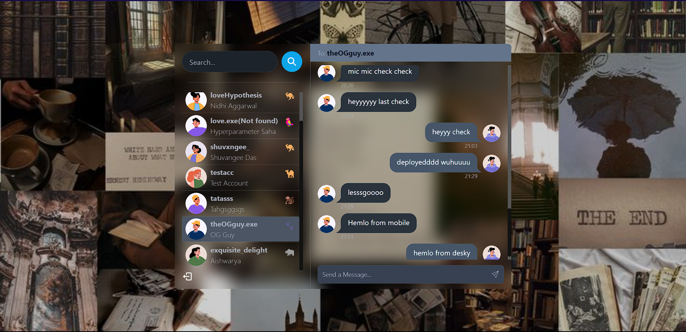
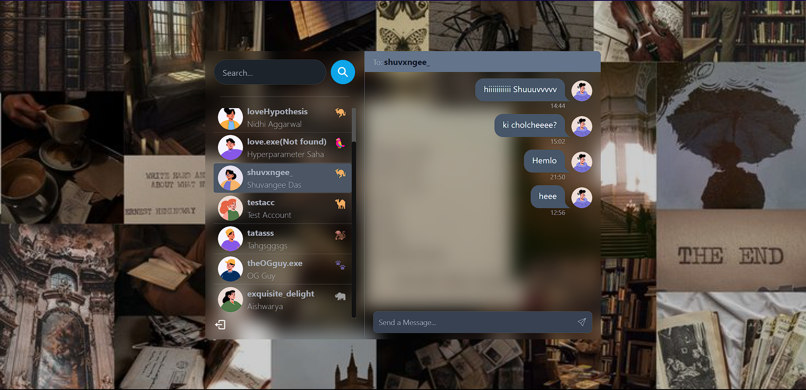

<h1 align="center">Nemesis - Online Chatting Website</h1>
<h3 align="center">A small scale real-time online chatting platform to chat with friends and build a community.</h3>

# Features

- Real-time chatting.
  
- Search users and like-minded peeps.
- Secure user experience.
- Secure database to store user data & credentials.
- Random emojis and avatars.
- Immersive user experience.

# Concepts Learned

- Developing interactive UI design using React.js, CSS3, Tailwind CSS & Daisy UI.
- Building a MongoDB integrated backend server to handle client-side requests and store user data in the DB.
- Implementing secure web-protocols like JWT-authentication, HTTP-only-cookies, Hashing of passwords, etc.
- Using backend controllers and client-side React state managers, including Zustand to ensure seamless integration of the backend with frontend.
- Integrating socket.io server over the main backend server to facilitate real-time data transfer between users, maintain online-status, without having to refresh the page at each update of the interface.
- Version Control using GitHub.
- Deployment fine-tunings like runtime-build commands and accomodating both the backend and the frontend on a single host during production.

# Tech Stack

         

# Demo

https://github.com/Tamoziit/Nemesis/assets/147103492/9274f800-1654-4c68-883f-be59a2106ac0

<h4 align="left">Check it out here! &#128526;</h4>
[Nemesis] (https://nemesis-owrb.onrender.com/)
